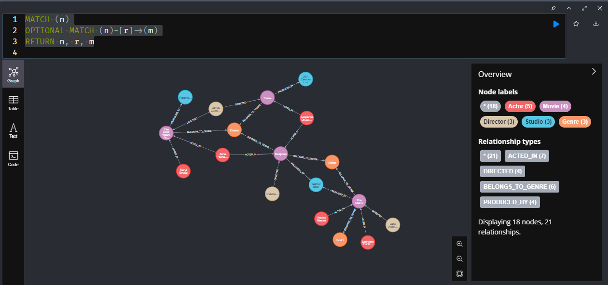
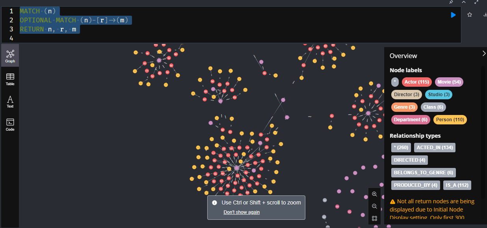

# Knowledge Graph Examples

This repository demonstrates the creation and visualization of knowledge graphs using Neo4j. It contains two examples:

---

## 1. **Simple JSON-Based Knowledge Graph (`Knowledge Graphs_Simpledata.ipynb`)**
- **Description**: A Jupyter Notebook that creates a small-scale knowledge graph from JSON data.
- **Purpose**: Illustrates how data can be structured, added to a graph, and visualized interactively.
- **Features**:
  - Uses JSON data to represent relationships between entities.
  - Shows the steps to insert nodes and relationships.
  - Includes a visualization of the final graph.

---

## 2. **Movie Knowledge Graph with Ontology and Taxonomy (`movie_graph.py`)**
- **Description**: A Python script that builds a comprehensive knowledge graph using a real movie dataset.
- **Purpose**: Demonstrates the use of ontology and taxonomy to model complex relationships in a knowledge graph.
- **Features**:
  - **Ontology**: Defines hierarchical relationships (e.g., `Actor IS_A Person`).
  - **Taxonomy**: Groups entities into classes and departments (e.g., `Crew WORKS_IN Department`).
  - **Real-world dataset**: Includes actors, crew, movies, and their interconnections.

## The dataset is in this link called credit.csv => https://www.kaggle.com/datasets/rounakbanik/the-movies-dataset 

## Graph Visualizations
Below are sample images demonstrating how the graphs look once created in neo4j:

Notice: The dataset used in this repository is not normalized and may contain missing nodes or other errors. The primary purpose of this repository is to demonstrate the concept and functionality of knowledge graphs.
